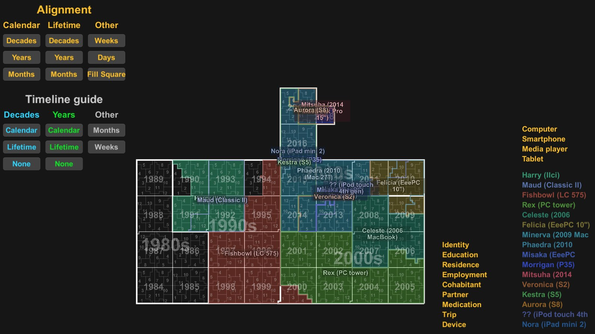
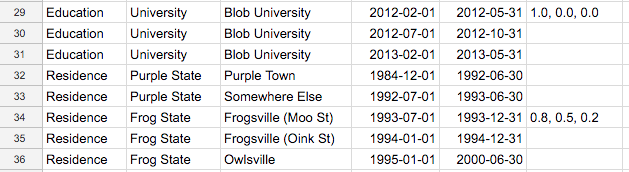
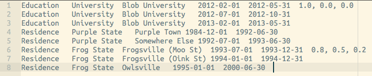

## Hilbert Map

This is a little toy I made on a whim. It takes input from a tab-separated text file `input.txt` in the same directory as the executable, and creates a two-dimensional map of grouped time-span data using a Hilbert curve. It assumes timescales on the order of decades. I tested it with data about my life - places I've lived, people I've lived with, schools and universities I attended, etc. Basically I just wanted to visually compare timespans and see what my life would look like when laid out like this. It was more or less a weekend project, so the code is quick and dirty and not nicely compartmentalised (monolithic classes ftl). Done in Unity 2017.3 in the Unity Toys mother-project.

The easiest way to enter the data is to use Google Sheets, and copy-paste the whole block of data into a text editor (make sure spaces-for-tabs isn't messing up the tabs). Each line should be five cells long minimum, with the five cells containing the following data: layer, group, name, start date and end date. Dates must be in the format YYYY-MM-DD. For example:

`Education` `High School` `Moocow High` `2000-02-01` `2002-12-15`

Optionally, a sixth cell can contain the colour you want for that piece of data, as three comma-separated floats, for example `0.8, 0.5, 0.2`.

You can list multiple entries with the same name - this way you can have a single datum correspond to multiple separate units of time. I used this to add university semesters separately.

*Example data in Google Sheets...*

*...And in a text editor*

The timespan of the entire map is from the earliest date found in the data, up to the present day. When running, you have a few different options for displaying the data. The alignment options change how the data is aligned with the Hilbert curve - you can map lifetime years or decades (starting from the earliest date found in the data) squares or rectangles, for example, or use calendar years instead. Similarly, the timeline labels (showing where decades, years etc are located on the map) can be aligned to lifetime or calendar units.

The lists on the right are where you can view different sets of data. The left-hand list shows layers, which correspond to the leftmost cells in the data. Clicking on one of these will show the groups and named elements for that layer in the right-hand list. You can mouse over groups and elements to highlight them individually on the map.

Windows and macOS builds can be found [in this Dropbox directory](https://www.dropbox.com/sh/bvji3frjurmkfqf/AADE7BN2eNXVbJ6rDNSjitMJa?dl=0).