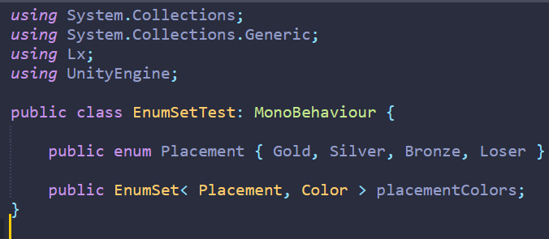

## EnumSet type ##

Are you like me and very often find yourself using sets of fields in Unity classes that correspond to values in an enum type? Like.. you want to associate the values of an enum with a set of colors, or sprites, or serialized objects, or a weird struct you pulled from StackOverflow, whatever.

I got tired of doing this so made an easy-to-use collection type that does everything I'd espect from a basic supported collection type in C#/Unity. `EnumSet` is a dictionary-like generic type that uses the values of an enum type as its keys, and whatever you want as its values. It has its own property drawer for use in a Unity inspector, serialises properly and robustly, and can be used outside of Unity without modification as a plain code-only collection type.

 

The value type can be anything you like; if serialised, the property drawer will handle it - with the exception of regular lists and arrays, due to a quirk of nested serialisation in Unity I haven't quite worked out. However, there's an `EnumSetList< T >` generic type provided in lieu, which works just fine as a serialisable stand-in for a list/array. It implements `IList< T >`. Otherwise, types with weird custom property drawers or whatever should work just fine with `EnumSet` including prefab override marking. The inspector will warn when attempting to use regular lists or arrays.

`EnumSet< TKey, TValue >` implements `IDictionary< TKey, TValue >`, with the constraint that `TKey` is an `Enum` type, and has been tested in Unity 2020.3 and 2022.1. It won't serialise in versions of Unity prior to 2018-ish (when serialisation of arbitrary generic types became supported), but at least shouldn't break.

Usage is quite simple - it supports everything a dictionary does, including the indexer. The keys and collection size are initialised on access or serialisation if necessary. The `Keys` and `Values` properties return read-only collections. Collection initialiser syntax is supported, and the enumerator iterates over `KeyValuePair< TKey, TValue >`s as expected. Anything that tries to modify the keys or that would break the one-to-one relationship between enum values and collection keys will throw an exception.

And just for peace of mind: in case you have a disaster and half your enum values are accidentally baleeted, the previously-serialised values corresponding to them won't be lost. They'll be sitting there invisibly in the serialised data while you fix your enum.